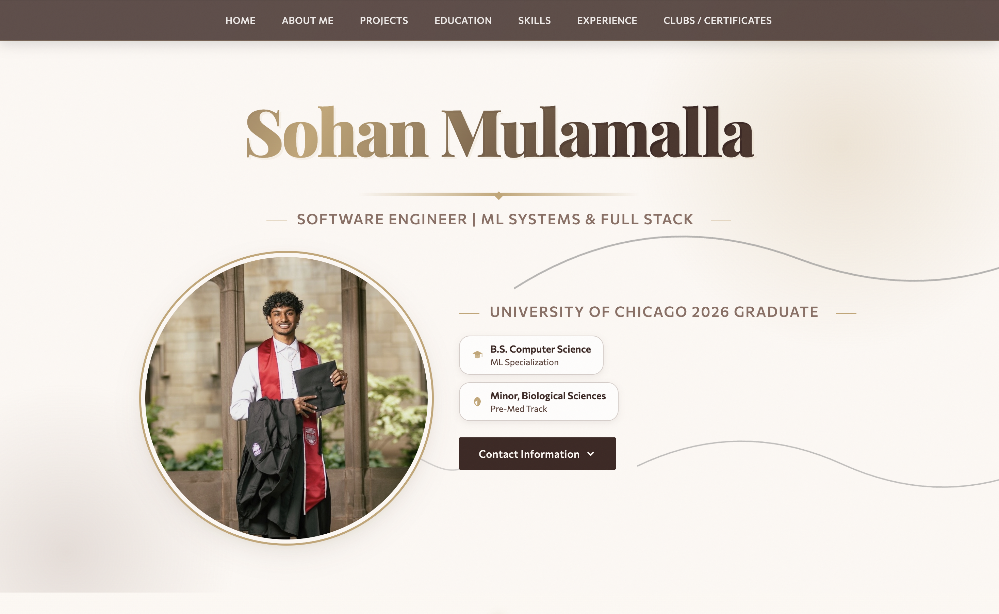

# Sohan Mulamalla — Portfolio 🎓

**A personal portfolio site showcasing my background, projects, and experience in software engineering and AI for healthcare.**

[](https://smulamalla.github.io/)


This is my personal portfolio: a single-page site built from scratch to introduce who I am and showcase the projects, experience, and skills behind my work applying machine learning to healthcare.



---

## Highlights

- 🎨 Alternating light/dark sections with a seamless, color-inverting scroll transition
- ✍️ Typewriter-style intro animation with a springy photo reveal
- 📂 Expandable project cards, each with its own day-by-day development blog
- 🌊 Animated, scroll-reactive background line art
- 🧭 Fixed navigation bar with smooth in-page scrolling
- 📱 Fully responsive — no build tools or frameworks required

## Sections

| Section | What's there |
|---|---|
| About Me | A short introduction to who I am and what I'm focused on |
| Projects | Deep dives into DiaGuide AI, CardioLens AI, and other ongoing work, each with progress blogs |
| Education | Degree, specialization, minor, and relevant coursework |
| Technical Skills | Languages, ML/frameworks, data stack, and tools |
| Experience | Work history, including clinical data abstraction and software development |
| Clubs / Certificates | Extracurriculars and completed certifications |

## Tech stack

Built with plain HTML, CSS, and JavaScript — no frameworks, no build step, no dependencies to install.

| Layer | Tool |
|---|---|
| Structure | HTML5 |
| Styling | Custom CSS (CSS variables for theming) |
| Interactivity | Vanilla JavaScript |
| Fonts | Playfair Display, Cormorant Garamond, Commissioner (Google Fonts) |
| Hosting | GitHub Pages |

## Project structure

```
smulamalla.github.io/
├── index.html          # The entire site — structure, styles, and scripts
└── assets/
    └── pfp.jpeg          # Profile photo
```

## Running locally

**1. Clone the repo**
```bash
git clone https://github.com/smulamalla/smulamalla.github.io.git
cd smulamalla.github.io
```

**2. Open it**
```bash
open index.html        # macOS — or just double-click the file
```

No install step and no server needed — it's a static page.

## Author

**Sohan Mulamalla**

Software engineer focused on ML systems and applying AI to healthcare.

- GitHub: https://github.com/smulamalla
- LinkedIn: https://www.linkedin.com/in/smulamalla/
- Portfolio: https://smulamalla.github.io/